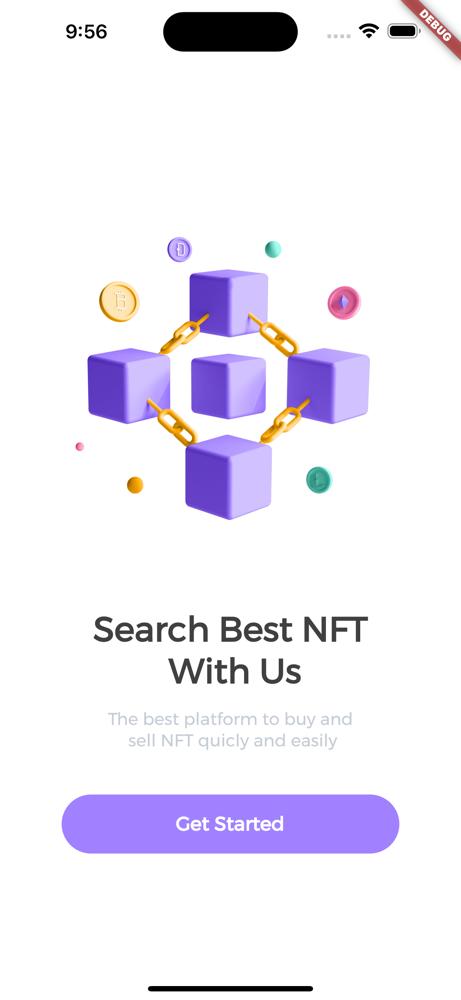
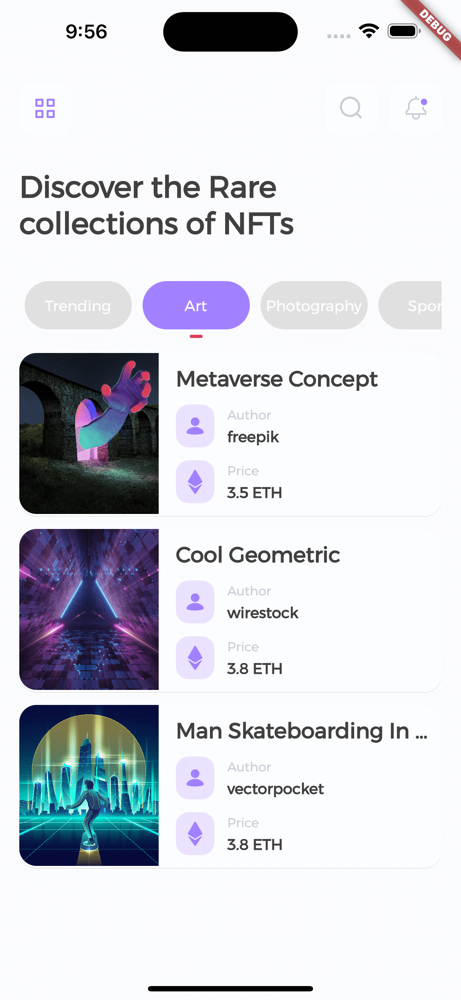
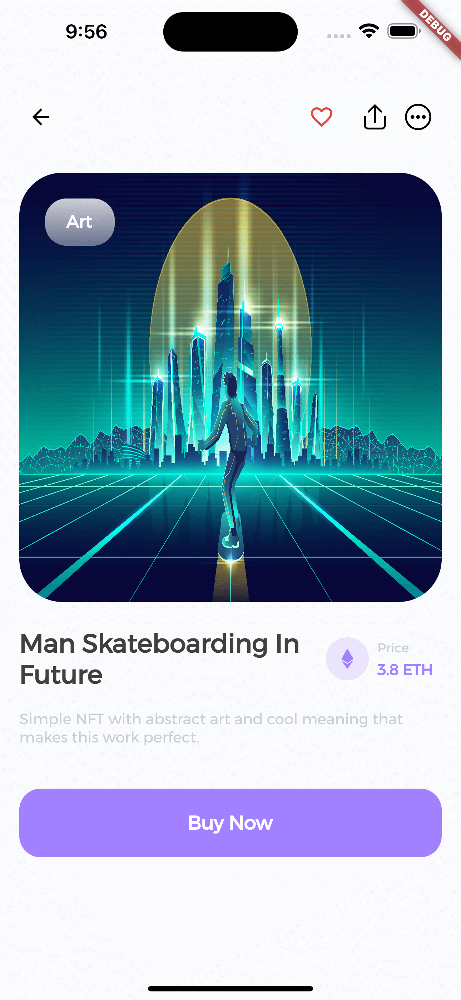

## Description

Projek ini merupakan projek yang digunakan sebagai proyek akhir yang menjadi syarat dalam kelulusan pada kelas [Belajar Membuat Aplikasi Flutter untuk Pemula](https://www.dicoding.com/academies/159). Berikut kriteria submission yang harus dipenuhi :
1. Terdapat penggunaan Stateless Widget. Misalnya untuk menampilkan Row atau Column.
2. Terdapat penggunaan Stateful Widget. Misalnya untuk menerima input atau widget yang menampilkan status aplikasi.
3. Memiliki minimal 2 (dua) halaman dan menerapkan Navigation.
4. Tidak memiliki tampilan yang overflow (dapat menyesuaikan ukuran layar). Poin plus jika tampilan responsif pada perangkat mobile dan browser.
6. Tema aplikasi yang dikirimkan bebas namun semakin detail dan lengkap aplikasi Anda maka nilai submission bisa lebih tinggi.

## Development Setup

Clone the repository and run the following commands:

```
flutter pub get
flutter run
```

## Source

Dicoding Academy

## Screenshot

 &nbsp;  &nbsp; 
